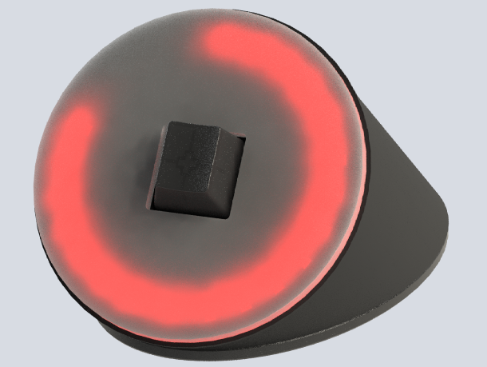
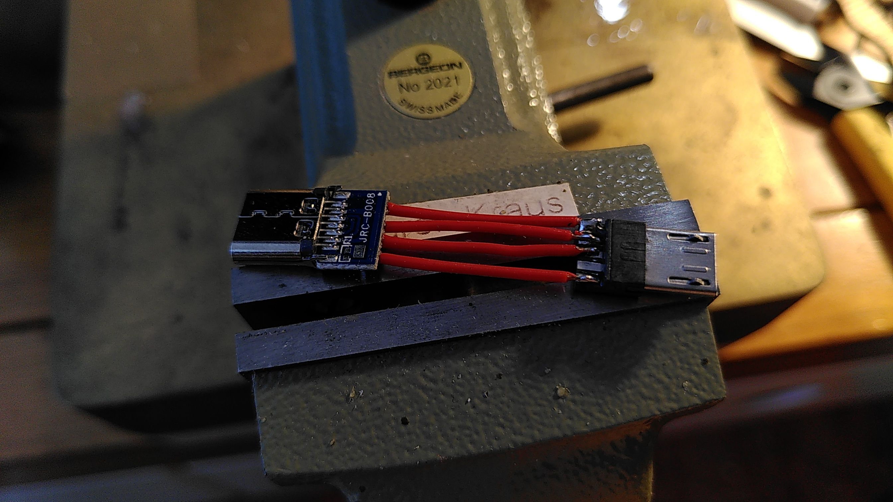
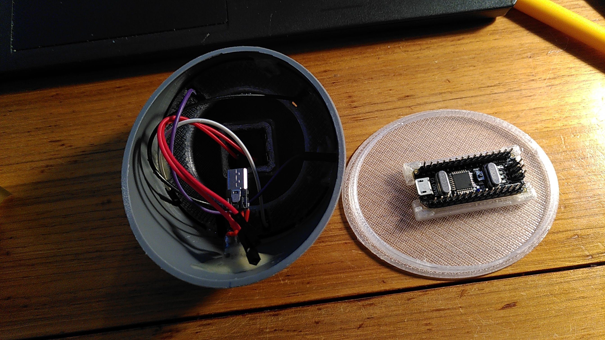

# NeoPomodorino
90% of the Work goes to https://github.com/atbrask/ with his nice Implimentation.

A Friend asked me if I could build him a [Pomodoro style timer](https://en.wikipedia.org/wiki/Pomodoro_Technique)

# BOM
- ~10cm DN75 'HT-Rohr' The German Standard Drainpipe (cut it in a 55° Angle)
- 3D Printed Top/Bottom
- Lasercut/CNC Milled Acrylic Front
- Adafruit Neopixel Ring with 24 LEDs
- 7-10 Dupont-Jumper Wire
- Cherry MX Switch+KeyCap
- USB-Micro Male Breakout
- USB-C Female Breakout
- Arduino Nano
- Piezo Buzzer

#How to
I developed my own Housing and plan to add a Piezo Buzzer that does a short 'Blip' noise as the Work & Break timer runs out. (But not Working yet)
Each 30/10/5s before the Work/Break switch.

No PCB Required, I just cut some Dupont-Jumper wire and Soldered them directly to the Neopixel Ring/Switch/Buzzer.

The Tiny USB-Micro to USB-C is a bit Tricky, use some Flux-Paste to make your work easyer.
Lookup your specific Breakout Board, some have a mixed up Pin-Order.

Cut a Slot in the Back of your Housing and Hotglue/2k Epoxy the USB-Adapter and the Arduino to the Housing Bottom as well as the Buzzer somewere to the Back of the Frontplate.
If the Switch is to loose in the Faceplate, glue it as well, but don't use Superglue the Vapor will damage the Switch and it will be unreliable.

# The Connections

- Neopixel have four Connections
- VCC is 5V
- GND goes to GND
- Sig/IN goes to Pin 6 of the Arduino.

- the Switch goes one pin to GND and the second to Pin 2 
- the Buzzer- goes to GND and to Pin 3 with a 100Ohm Resistor in Line. 
Pin3---[100R]---Buzzer+

The Prints take about 1 1/2h and ~29g PETG.

### Usage

* Long button presses (> 500ms) will turn the device on and off. This also resets the timer.
* Short button presses will add 1 minute to the current timer.
* Each pomodoro consists of 25 minutes of work (cyan-green'ish color) followed by a short 5 minute pause (orange color).
* [Planed] Buzzer 'Blips' 30s/10s/5s before a cycle ends
* Every fourth pause is a longer one of 25 minutes (white color).
* Between each pomodoro, the device will briefly flash which number is (blue color). 1 quarter of the ring = 1 pomodoro.
